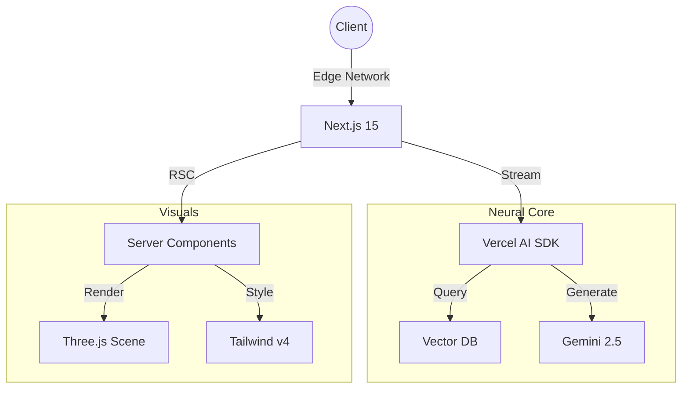

  
  
     
  
  
  
   
  
  

    <i>Architecting the future of digital experiences with Neural Networks & WebGL.</i>
  

  

   

  
  
  

 

> [!NOTE]
> **Minimalist. Premium. Performance.**  
> This portfolio is a showcase of *Next.js 15* bleeding-edge features, *WebLLM*, and *React Server Components*.

 

  <h2>⚡ Tech Stack</h2>
  
  <table>
    <tr>
      <td align="center"><b>Core</b></td>
      <td align="center"><b>AI & Data</b></td>
      <td align="center"><b>Design</b></td>
    </tr>
    <tr>
      <td align="center">
        
         
        
      </td>
      <td align="center">
        
         
        
      </td>
      <td align="center">
        
         
        
      </td>
    </tr>
  </table>

 

## 🧪 Featured Experiences

<table width="100%">
  <tr>
    <td width="55%">
        <h3>🔭 Vogue Scandinavia</h3>
        
<i>Immersive WebGL Runway w/ RAG AI</i>

        
A bespoke runway experience where editors scrub across time, revealing look layers triggered by AI commentary on every scene.

        

            
            
        

    </td>
    <td width="45%" align="center">
        
    </td>
  </tr>
  <tr>
    <td width="45%" align="center">
        
    </td>
    <td width="55%">
        <h3>🚀 SpaceX Starship</h3>
        
<i>Mission Control Simulator</i>

        
Browser-based mission control with real telemetry, GPU smoke sims, and AI-guided mission status for VIP guests.

        

            
            
        

    </td>
  </tr>
</table>

 

  

## 🏗️ Architecture

 

  

